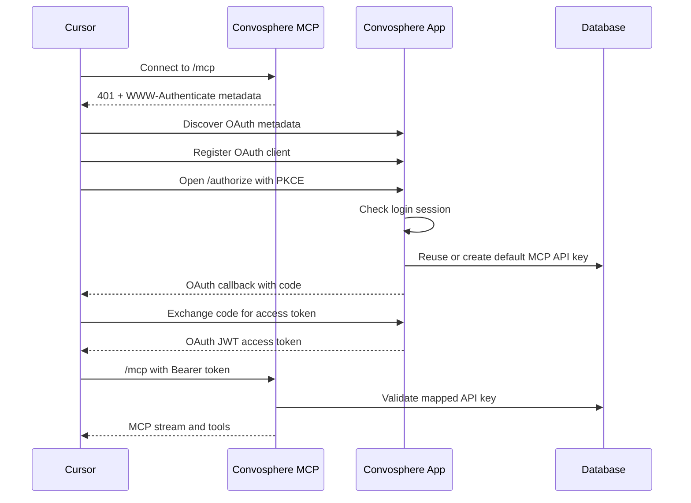

Convosphere MCP lets Cursor call your Convosphere tools directly from the IDE. The current setup uses OAuth, so you do not need to paste a secret API key into Cursor.

<Check>
Cursor connects with a URL-only MCP config, then Convosphere signs you in, maps your default MCP API key automatically, and returns an OAuth token to Cursor.
</Check>

## What changed

- Cursor setup now uses a real MCP install deep link instead of a generic settings link.
- The MCP server advertises OAuth protected-resource metadata for client discovery.
- Cursor registers as an OAuth client, opens the browser, and completes the PKCE authorization flow.
- If you are not logged in, Convosphere redirects to `/login?return_uri=...` and returns you to the original MCP authorization flow after login.
- If you are logged in, Convosphere automatically creates or reuses your default MCP API key with the `mcp` scope.
- Cursor stores the OAuth access token and sends it to the MCP server as a Bearer token.
- MCP-proxied tools forward your authenticated user context to application routes, so user-scoped tools work without browser cookies.

## Prerequisites

- Cursor installed.
- A Convosphere account.
- Access to the Convosphere app.
- For local development, the frontend and MCP server must both be running.

<Tabs>
<Tab title="Local development">

Use these default local URLs:

```text
Frontend: http://127.0.0.1:3001
MCP server: http://127.0.0.1:3090/mcp
```

</Tab>
<Tab title="Production">

Use the MCP URL shown in your Convosphere MCP settings page. Do not manually add an API key unless your client does not support OAuth.

</Tab>
</Tabs>

## One-click Cursor setup

<Steps>
<Step title="Open MCP settings">
Go to Convosphere **Settings → MCP**.
</Step>

<Step title="Choose Cursor">
Select the Cursor client setup option.
</Step>

<Step title="Install the MCP server">
Click the setup button. Convosphere opens a `cursor://` install link that adds a URL-only MCP server config to Cursor.

The config should look like this:

```json
{
  "mcpServers": {
    "convosphereMcp": {
      "url": "http://127.0.0.1:3090/mcp",
      "headers": {}
    }
  }
}
```
</Step>

<Step title="Authorize in the browser">
Cursor opens the browser for OAuth. If you are not signed in, Convosphere sends you to:

```text
/login?return_uri=...
```

After login, the authorization flow resumes automatically.
</Step>

<Step title="Return to Cursor">
The browser shows a handoff page with progress steps, then opens Cursor through the OAuth callback. If your browser asks for permission, click **Open Cursor**.
</Step>
</Steps>

## Authentication flow



## Automatic API key mapping

During OAuth authorization, Convosphere checks your account for a valid default MCP API key.

If a valid key exists:

- It reuses the key.
- It ensures the key is not revoked or expired.
- It verifies the key has the `mcp` or `*` scope.

If no valid key exists:

- It creates a default key for MCP.
- It stores the key ID on your user profile.
- It binds the OAuth authorization code to that key ID.

The raw key secret is not sent to Cursor. Cursor receives an OAuth access token, and the MCP server validates the token against the stored key ID.

## Browser behavior

Direct browser access to the MCP endpoint is handled differently from API clients:

- Browser navigation with `Accept: text/html` redirects to the Convosphere login/settings flow.
- Programmatic MCP calls without auth still receive a JSON-RPC auth error.

This keeps MCP protocol behavior correct while giving humans a useful page instead of a raw JSON error.

## Test the connection

After connecting, ask Cursor to call a simple tool:

```text
Use convosphereMcp whoAmI
```

Expected response:

```json
{
  "role": "user",
  "plan": "free",
  "tracked": true,
  "authKind": "oauth_jwt"
}
```

Then test tool discovery:

```text
Use convosphereMcp getSessionContext
```

And usage tracking:

```text
Use convosphereMcp getUsageMetrics
```

## Troubleshooting

<AccordionGroup>
<Accordion title="Cursor keeps asking for auth">
Use Cursor's MCP controls to log out of the `convosphereMcp` server, then connect again. This clears stale OAuth state and forces Cursor to use the latest server metadata.
</Accordion>

<Accordion title="The browser shows an Open Cursor prompt">
Click **Open Cursor**. Browsers require confirmation before launching `cursor://` deep links.
</Accordion>

<Accordion title="The browser shows Missing or malformed Authorization header">
You are likely visiting the MCP endpoint as an API request instead of an interactive browser navigation, or your server is missing the browser redirect handling. Use the setup flow from **Settings → MCP**.
</Accordion>

<Accordion title="Cursor reports Unexpected content type text/html">
Cursor is pointing at the frontend app instead of the MCP server. Verify the MCP URL points to the MCP endpoint, for example `http://127.0.0.1:3090/mcp` in local development.
</Accordion>

<Accordion title="Token exchange succeeds but tools still require auth">
Check that the MCP server can validate tracked tokens against the database and that the frontend and MCP server share the same `MCP_JWT_SECRET`.
</Accordion>
</AccordionGroup>
